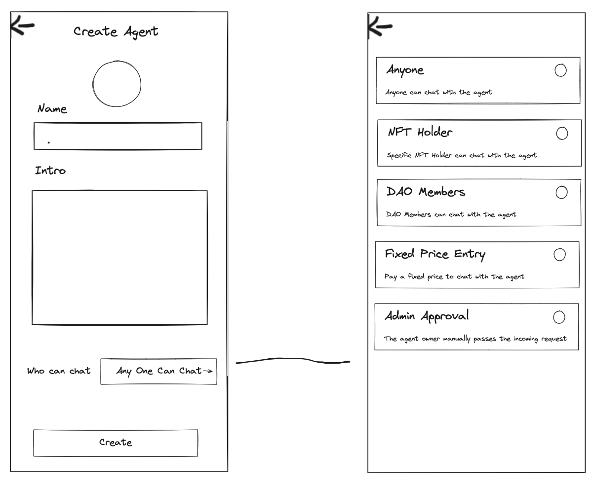
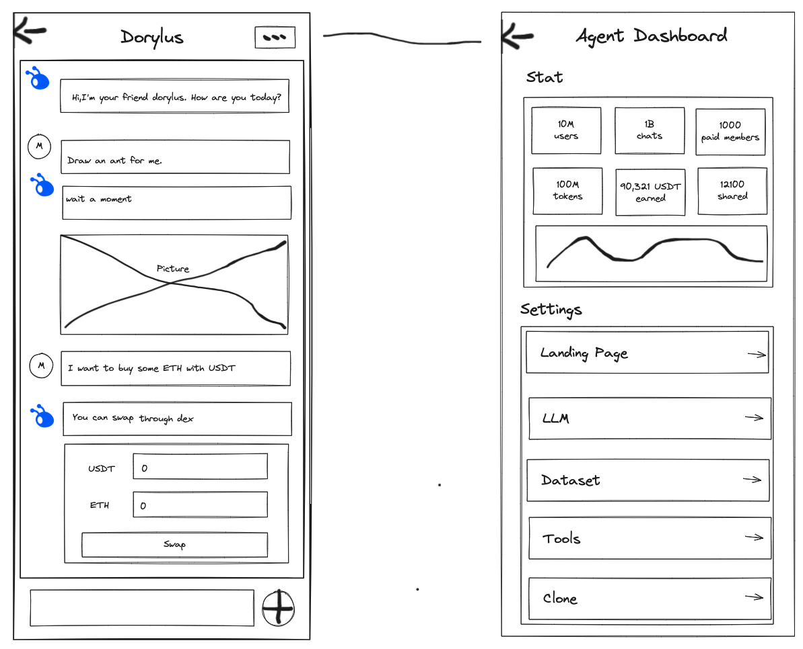
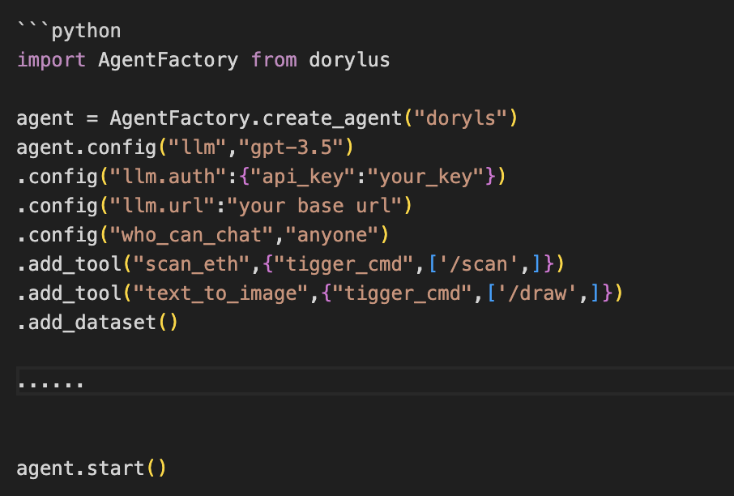

# 2.1 Creating Your Own Agent

## 2.1.1 Creating Your Own Agent Through the UI Interface

Directly create through the UI interface.

### Setting the basic information 

### Setting related information such as the model, tools, datasets, etc.

## 2.1.2 Creating Through a Programmatic API Interface

