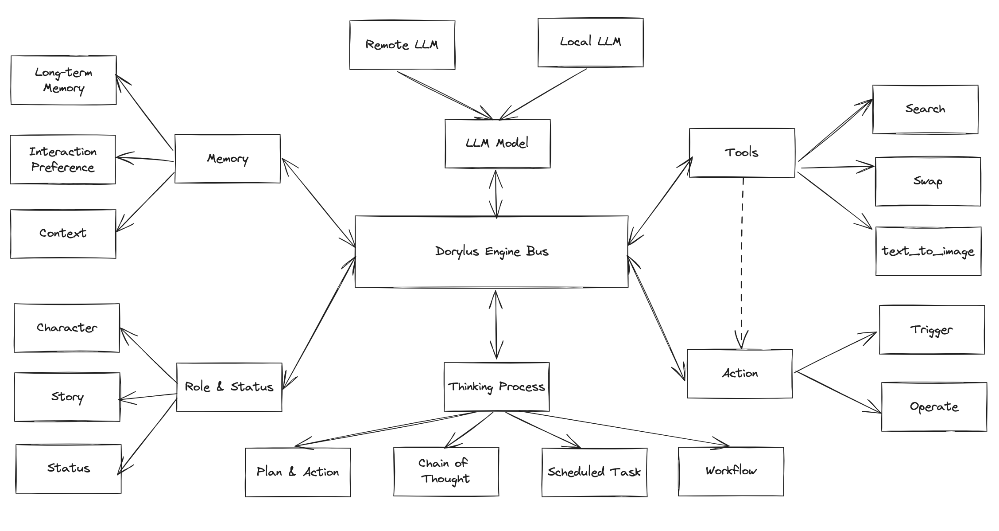
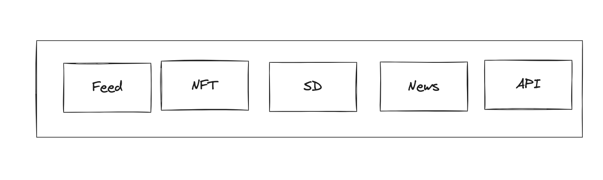
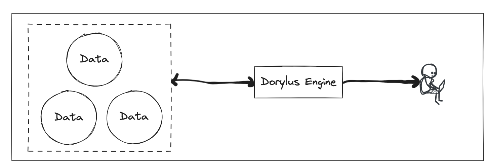
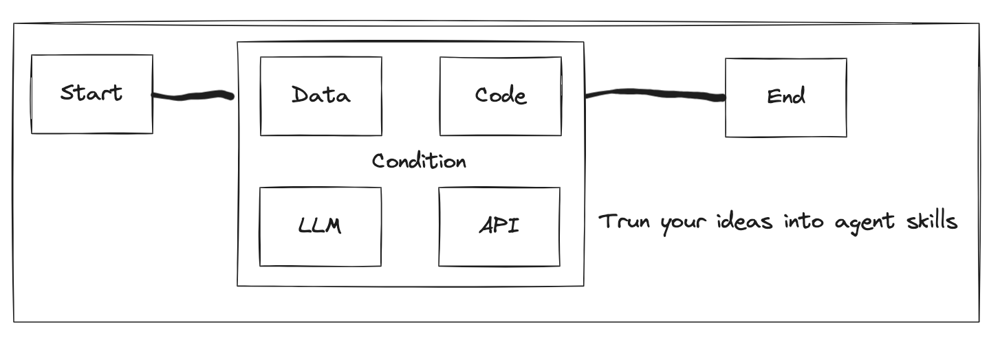

# 2.2 Dorylus Engine

## Framework: Develope your Agent with our dorylus framework

## Tools: Enhance the capabilities of your Agent
Dorylus will integrates a rich set of plugin tools, significantly expanding the potential of AI Agent. The platform will including news reading, quant bot, token exchange , productivity tools, image understanding APIs, and multimodal models.

## Knowledge: Let your Agent interact with your data
Agent offers an easy-to-use knowledge base capability, enabling AI to interact with your data. You can store and manage data in the knowledge. Whether you need to process hundreds of thousands of words from a PDF or real-time information from a website, simply create a knowledge base, and your Agent can access the relevant knowledge.

- Import dozens of pages of product documentation into the knowledge, and within minutes, generate your exclusive product consultant.
- Incorporate news sites or online papers you frequently visit into the knowledge, and your Agent will gather the latest updates and trends for you daily.
- Subscribe your discord channel and summary the information

## Long-term Memory: Equip your Agent with persistent memory

Agent provides a convenient database memory capability for AI interactions. With this feature, you can enable the AI Agent to persistently remember crucial parameters or content from your conversations.

- Let the Agent remember your dietary preferences and recommend restaurants based on your tastes.
- Allow the Agent to recall your height and weight, facilitating quick consultations tailored to you.

## Scheduled Tasks: Allow your Agent to initiate conversations
Do you wish your Agent could proactively send you messages? With the scheduled tasks feature, users can effortlessly create complex tasks using natural language. Your Agent will send you the corresponding message content punctually.

- Have your Agent recommend personalized news every morning at 9:00.
- Allow your Agent to plan your summary the community information  everyday.

## Workflow: Turn your ideas into Agent skills

You surely have many innovative ideas and methodologies. If you want the Agent to employ these unique methods on your behalf, you can easily create a workflow to transform them into Agent skills. If you're proficient in coding, you can use code snippets within the workflow to craft intricate functions. If you're not, don't worry; with simple operations, you can still design your workflow.

- Design a workflow to gather token price data, allowing you to buy or sell at special price.
- Create a workflow to draft industry research reports, letting the Agent write a 20-page report for you

## Where can Agent be deployed?
Once created, Agents can be published on various social platforms and messaging tools.  The  platforms we are going to support include:

- Hajime
- Telegram

