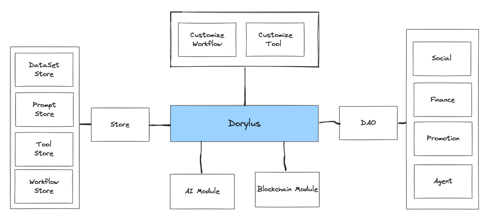

# 介绍
Dorylus是一个AI智能体引擎，让非技术人员也可以通过可视化的方式训练自己的人工智能Agent，让这个Agent去完成各种各样的任务，并且帮助广大的用户将自己的数据、技能、创造力和 API 进行货币化。

在Dorylus平台可以将NFT和智能体进行绑定,让NFT成为可以沟通、有行为、可以

## Dorlus架构

### AI模块和区块链模块

Dorylus将AI和区块链能力,比如故事创作、文档总结、文生图、文生视频、角色模拟、DEX、抵押、借贷、红包等等封装为独立的一个个模块,让用户可以自由选配;
用户可以给自己的智能体装配更多的模块来不断的增强能力。

### 商店
你可以在商店里找到各种各样的工具和组件来满足你多样性需求
- 数据集:一些已经向量化的数据集，可以供Agent直接使用
- 提示词:针对不同角色或功能，预先配置好的提示词，确保效果
- 工具:扩展Agent的能力
- 工作流:集成Agent到业务流程当中

### 自定义工具和工作流
你可以通过平台提供的功能来自定义工具和工具流来训练自己的Agent，也可以出售自己定义的工具或工具流

### 内置DAO支持
- 社交:一个简洁的社交模块
- 财务:DAO管理的财务模块
- 推广:推广跟踪、奖励模块
- 智能代理:集成DAO社区的服务并对外提供服务

