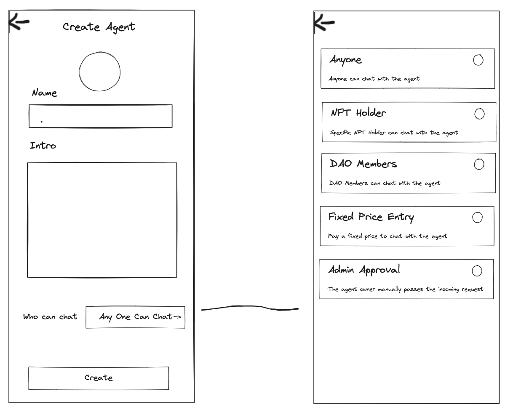
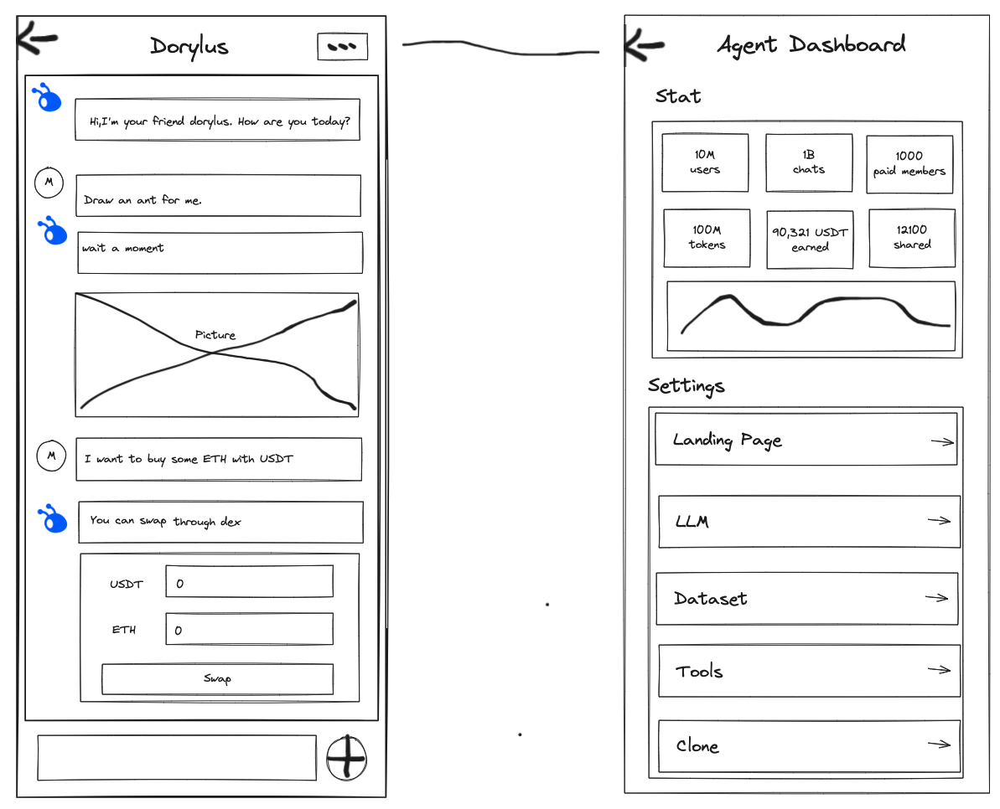

# 2.1 创建自己的Agent

我们有两种方式创建自己的Agent

## 2.1.1 通过UI界面创建自己的Agent

通过UI界面直接创建
### 设置名字介绍的基础信息


### 设置模型、装配的工具、数据集等等相关信息



## 2.1.2 Creating Through a Programmatic API Interface

```python
import AgentFactory from dorylus

agent = AgentFactory.create_agent("doryls")
agent.config("llm","gpt-3.5")
.config("llm.auth":{"api_key":"your_key"})
.config("llm.url":"your base url")
.config("who_can_chat","anyone")
.add_tool("scan_eth",{"tigger_cmd",['/scan',]})
.add_tool("text_to_image",{"tigger_cmd",['/draw',]})
.add_dataset()

......


agent.start()


```
