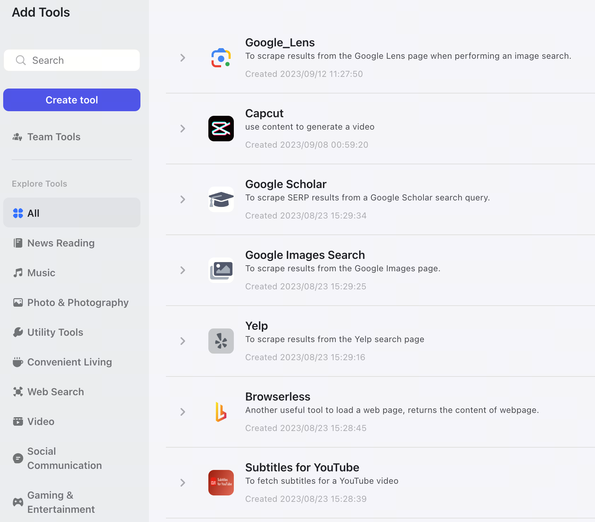

# Tools
By using tools, we can extend the capabilities of large models, such as enabling large models to search data online, meet some precise or real-time needs. Currently we provide some native tools, such as: Google Search, Browser, Capcut, etc, around ten plus categories of plugins.

A plugin can consist of one or multiple Tools. Each Tool requests data from different APIs and returns in a determined format. For example, the YouTube plugin has 2 Tools: searchYouTube and getVideoDetails. searchYouTube searches YouTube and returns video results. getVideoDetails takes a video ID and returns more detailed information about that video by calling a different YouTube API.

At the same time, it also supports plugins that conform to the ChatGPT Plugins standard and allows users to manually configure through the interface to create their own custom plugins。

## Binding data cards for plugins
We provide some display styles to allow plugins to present the returned data in a more aesthetic form.

