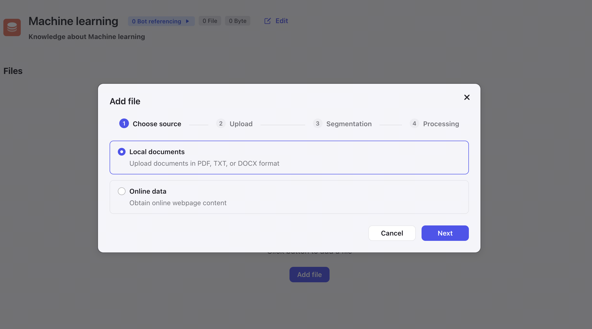
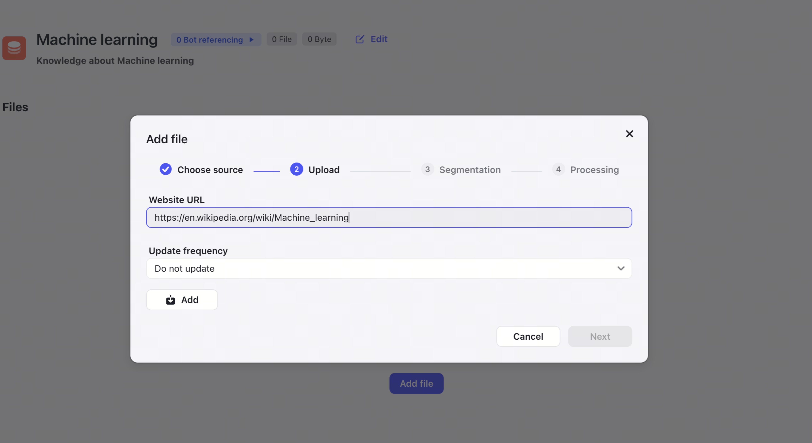

# Knowledge

## Create knowledge
Step 1: Locate the creation entry point
Switch to the Knowledge tab
Then click on "Create knowledge" in the top right corner

Step 2: Fill in the knowledge information
Knowledge name: Name
Knowledge description: Description Purpose:
Facilitate understanding of the Knowledge's function
Name uniqueness: Unique within TeamSpace and Person

Step 3: Add files to the knowledge
Entry point: Click on "Add file" within the knowledge

Supports two sources

Local files: Supports PDF, TXT, DOCX
Web pages

Upload content - Web page
Website URL
Update frequency

Content segmentation
Why is content segmentation necessary?
All LLMs have token count limitations, and very long content cannot be fully processed by the model. Therefore, by dividing the content into multiple segments and using "vector recall" methods, the most relevant segments can be recalled to help improve the accuracy of the model's answers.
Supports automatic segmentation and custom segmentation
Automatic segmentation:
Segmentation is done through separators while verifying that the maximum length of each segment is less than 800 tokens
Separators: ["\n\n", "\n", " ", ""]
Custom segmentation:
Allows specifying separators and maximum segment length

